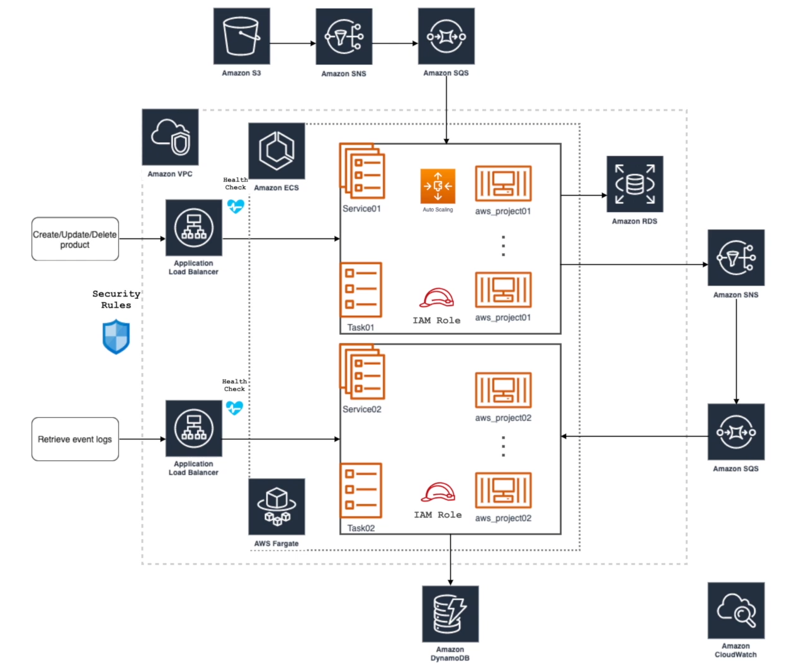

# SPRING BOOT AWS

> Projeto que demonstra como construir uma infraestrutura na AWS usando o AWS CDK (Cloud​Formation), interagindo com os serviços: Cloud​Formation, VPC, Fargate, ECS, EC2, RDS, SNS, SQS, DynamoDB, CloudWatch, S3.

## Project

    

## Initialize the project

### Prerequisites

- [Java JDK 11](https://www.oracle.com/br/java/technologies/javase-jdk11-downloads.html)
- [Gradle](https://gradle.org/install/)
- [Nodejs](https://nodejs.org/en/)
- [AWS CLI](https://docs.aws.amazon.com/cli/latest/userguide/install-cliv2.html)
- [AWS CDK](https://github.com/aws/aws-cdk)
- [Docker Engine](https://docs.docker.com/engine/install/)
- [Docker Compose](https://docs.docker.com/compose/install/)

---

### localstack / mariadb

- docker-compose up -d

- aws --endpoint-url=http://localhost:4566 s3api create-bucket --bucket pcs01-invoice
- aws --endpoint-url=http://localhost:4566 s3api put-bucket-acl --bucket pcs01-invoice --acl public-read-write

- aws --endpoint-url=http://localhost:4566 sns create-topic --name s3-invoice-events
- aws --endpoint-url=http://localhost:4566 sns create-topic --name product-events

- aws --endpoint-url=http://localhost:4566 sqs create-queue --queue-name s3-invoice-events-dlq
- aws --endpoint-url=http://localhost:4566 sqs create-queue --queue-name product-events-dql

- aws --endpoint-url=http://localhost:4566 sqs create-queue --queue-name s3-invoice-events --attributes '{"RedrivePolicy": "{\"deadLetterTargetArn\":\"arn:aws:sqs:us-east-1:000000000000:s3-invoice-events-dlq\",\"maxReceiveCount\":\"3\"}", "VisibilityTimeout": "3600"}'

- aws --endpoint-url=http://localhost:4566 sqs create-queue --queue-name product-events --attributes '{"RedrivePolicy": "{\"deadLetterTargetArn\":\"arn:aws:sqs:us-east-1:000000000000:product-events-dql\",\"maxReceiveCount\":\"3\"}", "VisibilityTimeout": "3600"}'

- aws --endpoint-url=http://localhost:4566 sns subscribe --topic-arn arn:aws:sns:us-east-1:000000000000:s3-invoice-events --protocol sqs --notification-endpoint arn:aws:sns:us-east-1:000000000000:s3-invoice-events

- aws --endpoint-url=http://localhost:4566 sns subscribe --topic-arn arn:aws:sns:us-east-1:000000000000:product-events --protocol sqs --notification-endpoint arn:aws:sns:us-east-1:000000000000:product-events

- aws --endpoint-url=http://localhost:4566 s3api put-bucket-notification-configuration --bucket pcs01-invoice --notification-configuration file://aws_project01/aws/notification.json

- aws dynamodb create-table --cli-input-json file://aws_project02/aws/dynamodb_table.json --endpoint-url=http://localhost:4566

---

### Verify

- aws --endpoint-url=http://localhost:4566 s3api list-buckets
- aws --endpoint-url=http://localhost:4566 dynamodb list-tables
- aws --endpoint-url=http://localhost:4566 sns list-topics
- aws --endpoint-url=http://localhost:4566 sqs list-queues
- aws --endpoint-url=http://localhost:4566 sns list-subscriptions

---

### Insert file

- aws --endpoint-url=http://localhost:4566 s3 cp aws_project01/aws/invoice.txt s3://pcs01-invoice
- curl -v http://localhost:4566/pcs01-invoice/invoice.txt
